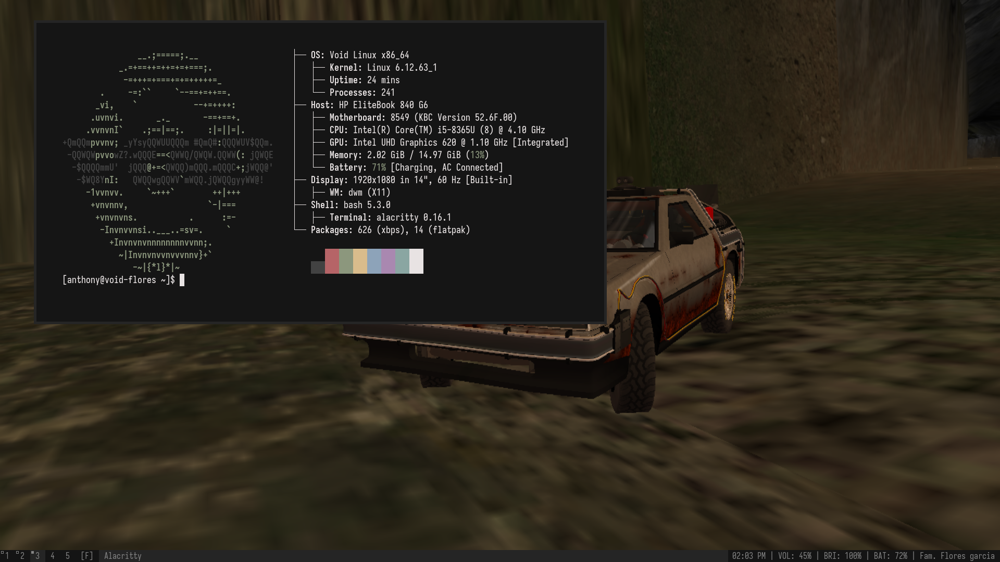

### Instrucciones básicas de mi gestor de ventanas DWM

Paquetes necesarios para la instalación y compilación de DWM `git base-devel libx11-devel libxft-devel libxinerama-devel`

**Otros paquetes y fuente utilizada**
- Terminal: Alacritty
- Launcher: Rofi 
- Font: Iosevka 
- Screenshot: Flameshot 

**Control** 
- Brillo: `brightnessctl`
- Sonido: `pamixer`
- Wifi: `wireless_tools`

**Atajos de teclado**

| Atajo             | Acción                 |
| ----------------- | ---------------------- |
| Super + Enter     | Alacritty              |
| Super + Space     | Rofi launcher          |
| Super + Shift + q | Salir de dwm           |
| Super + T         | Modo tiling            |
| Super + F         | Modo flotante          |
| Super + M         | Modo stacking          |
| Super + B         | Esconder barra         |
| Super + P         | Flameshot (screenshot) |

